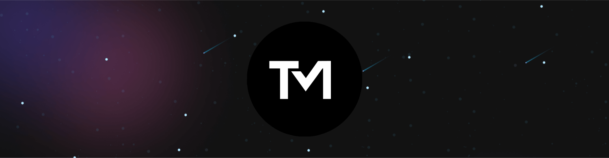

  

###

<h1 align="center">Salut ! Je m'appelle Thomas👋🏻</h1>

###

<h2 align="center">👨🏻‍🎓Étudiant à La Manu - Amiens</h2>

###

<h3 align="left">🛠 Languages et outils</h3>

###

  
  
  
  
  
  
  
  
  
  
  
  
  
  
  
  
  
  
  

###
